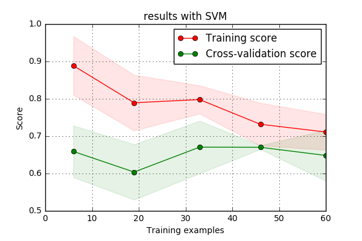

# Predicting Swiss Ice Hockey Playoffs using Machine Learning Models

## Table of Contents

[Introduction](#Introduction)

[Data](#data)

[Method](#method)

[Results](#results)

[Discussion](#discussion)

[Conclusion](#conclusion)

[Future Outlook](#future-outlook)

[File Contents](#file-contents)

## Introduction
Our goal in this project is to predict the outcome of playoff series of the Swiss ice hockey league.
Predicting the outcome of sports matches from statistics and performance data has always been an attractive but challenging task. Even more so in ice hockey where not much work has been devoted so far compared to other sports.

In hockey, as in many other sports, the best teams of the season go through a direct elimination tournament called the playoffs. To advance in the tournament, teams face each other through a best-of-seven series i.e. the first team to win four games wins the series.

There are two main leagues in Switzerland. The national league A (NL A), being the top tier league, and the national league B (NL B), the inferior division. Both of these leagues are composed of 12 teams each. During the regular season, each team plays 50 games. The top eight teams after the regular season qualify for the playoffs to determine the Swiss champion in best-of-seven series.

In this project, we tried to predict the outcome of the series instead of individual games, this is motivated by several factors. First of all randomness plays a huge role in the outcome of single game, a mathematically better team has a 24% chance of always beating an easier opponent. Secondly, this is harder to intuitively define the features for each game.
## Data
We gathered statistic from seasons 2008-2009 to 2015-2016 from the [Swiss Ice Hockey Federation](http://www.sihf.ch/fr/). We extracted the regular season data of each team for both the NL A and NL B. Our data generation pipeline is composed of two steps. First, we build feature vectors of regular season statistics for each team and each season, these statistics include:

* Year: the season
* GF: number of goals scored.
* GA: number of goals conceded.
* GF even: number of goals scored 5v5.
* GA even: number of goals conceded 5v5.
* PPG: number of goals scored in numerical superiority.
* PP GA: number of goals conceded in numerical superiority.
* SHG: number of goals scored in numerical inferiority.
* PK GA: number of goals conceded in numerical inferiority.
* SOWGF: number of goals scored in penalty shootouts.
* SOWGA: number of goals conceded in penalty shootouts.
* PP OP: number of situations in numerical superiority.
* PPT: time in numerical superiority.
* PP%: efficiency in numerical superiority.
* PK SI: number of situations in numerical inferiority.
* PKT: time in numerical inferiority.
* PK%: efficiency in numerical inferiority.
* GM: number of penalties for misconduct.
* MP: number of match penalties.
* 2': number of 2 min penalties.
* 5': number of 5 min penalties.
* 10': number of 10 min penalties.
* PIM total: total number of penalties.

We also have all of the preceding features per game. In total, this amounts to 34 features and 166 rows.

Secondly, we extracted the results of each game of the playoffs. We then aggregated those games to series and computed the winner. This second dataset has the following characteristics:

* Series_ID: a unique identifier of the season and the two teams involved e.g. `0910_HC Davos Kloten Flyers`
* Opponent 0/Opponent 1: the name of the teams involved.
* Winner: a label 0/1 depending on which team won the series.
* Homefield advantage: the name of the team that played the most at home during the series.

Since the top 8 teams face each other in the playoffs in each league, we have 7 series for each league and each season. This amounts to 112 observations in our dataset. 
Since we want to predict the winner of the series given both teams season statistics, we had to combine the two datasets in a smart way. We chose to compute the column wise difference between the feature vectors of each team involved in the series i.e.

`new_feature_vector = Opponent0_feature_vector - Opponent1_feature_vector`

and we append the label of the corresponding winner: 0 or 1.

We trained our models on seasons 08-09 until 14-15 and kept the playoffs of season 15-16 as our testing set.

**TODO:**

* add exploratory data analysis, plots de fref
* add feature importance, peut etre dans méthodes

## Method
After having preprocessed our data, all classfier parameters were chosen using grid-search and 5-fold cross-validation. Our results are reported here:

| Classifier | Mean Validation Accuracy (%)| std |
| :----: | :----: | :----: |
| Baseline | 50 | 0 |
| Random Forest | 57 | 0.08 |
| Logistic Regression | 61 | 0.14 |
| Neural Network | 66 | 0.07 |
| SVM | 71 | 0.1 |

Here is the learning curve obtained with our best performing model, SVM:

## Results
We used the NLA playoffs of the season 2015-12016 as our prediction testbed.

| Team 1 | Team 2 | Winner | Prediction |
| :----: | :----: | :----: | :--------: |
| SC Bern | ZSC Lions| SC Bern | **ZSC Lions** |
| HC Davos | Kloten Flyers | HC Davos | HC Davos |
| Genève-Servette HC | Fribourg-Gottéron | Genève-Servette HC | Genève-Servette HC |
| EV Zug | HC Lugano | HC Lugano | HC Lugano |
| SC Bern | HC Davos | SC Bern | SC Bern |
| Genève-Servette HC | HC Lugano | HC Lugano | HC Lugano |
| SC Bern | HC Lugano | SC Bern | SC Bern |

## Discussion

issues encountered / overfittting / etc
**TODO:**
* pas beaucoup de data, on a du ajouter la LNB
* on voulait faire par player mais on a pas pu
* peu de test set donc dur à correctement évaluer le modele, on a essayé de palier a ca en faisant l'average sr plusieurs runs

## Conclusion

## Future Outlook

## File contents
* `Data`: data folder.
* `ML.ipynb`: contains all the machine learning models tried, the hyperparamaters selection and the model validation.
* `Viz.ipynb`: contains all the functions used to plot the exploratory data analysis.
